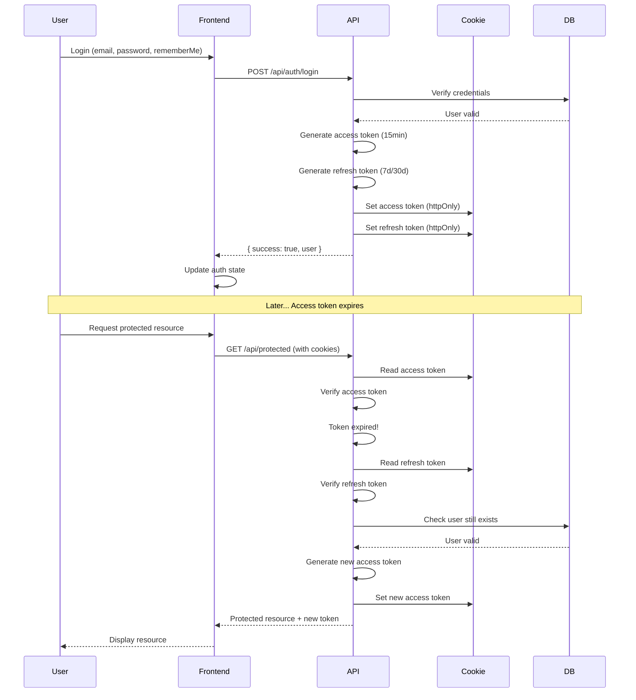

# JWT Refresh Token Implementation Plan

**Goal:** Implement a complete JWT refresh token system with access tokens, refresh tokens, cookie-based storage, remember me functionality, and integrate authentication APIs with the frontend login and registration forms.

---

## User Review Required

> [!IMPORTANT]
> **Token Configuration**
> 
> Based on the user's `.env` file configuration:
> - **Access Token:** Short-lived (15 minutes recommended)
> - **Refresh Token:** Long-lived (7 days for session, 30 days for remember me)
> - **Storage:** HTTP-only cookies for security
> - **Remember Me:** Controls cookie persistence (session vs persistent)

> [!WARNING]
> **Breaking Changes**
> 
> This implementation will:
> - Change how tokens are stored (from client-side to HTTP-only cookies)
> - Require frontend to handle cookies instead of localStorage
> - Add automatic token refresh logic
> - Change API response structure to exclude tokens (they'll be in cookies)

---

## Proposed Changes

### Backend Changes

#### [MODIFY] [jwt.ts](file:///e:/Others/next-e-commerce/lib/auth/jwt.ts)

**Current State:** Only supports access tokens

**Changes:**
- Add refresh token generation function
- Add refresh token verification function
- Update token expiry configuration
  - Access token: 15 minutes
  - Refresh token: 7 days (session) or 30 days (remember me)
- Add function to generate both tokens at once

**New Functions:**
```typescript
generateRefreshToken(payload: JWTPayload): string
verifyRefreshToken(token: string): JWTPayload | null
generateTokenPair(userId, email, role, rememberMe): { accessToken, refreshToken }
```

---

#### [NEW] [lib/auth/cookies.ts](file:///e:/Others/next-e-commerce/lib/auth/cookies.ts)

**Purpose:** Cookie management utilities

**Features:**
- Set access token cookie
- Set refresh token cookie
- Clear auth cookies
- Configure cookie options based on remember me
- HTTP-only, Secure, SameSite=Strict

**Functions:**
```typescript
setAuthCookies(response, accessToken, refreshToken, rememberMe)
clearAuthCookies(response)
getTokensFromCookies(request)
```

---

#### [MODIFY] [login/route.ts](file:///e:/Others/next-e-commerce/app/api/auth/login/route.ts)

**Changes:**
1. Accept `rememberMe` boolean from request body
2. Generate both access and refresh tokens
3. Set tokens in HTTP-only cookies
4. Don't return tokens in response body
5. Configure cookie expiry based on remember me

**Response Changes:**
```typescript
// Before: Returns token in body
{ success: true, token: "...", user: {...} }

// After: Token in cookie, not in body
{ success: true, user: {...} }
```

---

#### [MODIFY] [register/route.ts](file:///e:/Others/next-e-commerce/app/api/auth/register/route.ts)

**Changes:**
- Keep current behavior (no tokens until email verified)
- After OTP verification, issue tokens with cookies

---

#### [MODIFY] [verify-otp/route.ts](file:///e:/Others/next-e-commerce/app/api/auth/verify-otp/route.ts)

**Changes:**
1. Accept `rememberMe` boolean (optional, default false)
2. Generate both access and refresh tokens
3. Set tokens in HTTP-only cookies
4. Don't return tokens in response body

---

#### [NEW] [refresh-token/route.ts](file:///e:/Others/next-e-commerce/app/api/auth/refresh-token/route.ts)

**Purpose:** Refresh access token using refresh token

**Flow:**
1. Extract refresh token from cookie
2. Verify refresh token
3. Check if user still exists
4. Generate new access token
5. Optionally generate new refresh token (rotation)
6. Set new tokens in cookies
7. Return success

**Endpoint:** `POST /api/auth/refresh-token`

**Security:**
- Validates refresh token
- Checks user exists and is active
- Implements token rotation (optional)
- Rate limiting recommended

---

#### [MODIFY] [middleware.ts](file:///e:/Others/next-e-commerce/lib/auth/middleware.ts)

**Changes:**
1. Read access token from cookie instead of Authorization header
2. If access token expired, try to refresh using refresh token
3. If refresh successful, continue with new token
4. If refresh fails, return 401
5. Support both cookie and header for backward compatibility

**New Logic:**
```typescript
1. Try to get token from cookie
2. If no cookie, try Authorization header
3. Verify token
4. If expired and refresh token exists, refresh
5. If valid, continue
6. If invalid, return 401
```

---

#### [NEW] [logout/route.ts](file:///e:/Others/next-e-commerce/app/api/auth/logout/route.ts)

**Purpose:** Clear authentication cookies

**Flow:**
1. Clear access token cookie
2. Clear refresh token cookie
3. Optionally invalidate refresh token in DB (if stored)
4. Return success

**Endpoint:** `POST /api/auth/logout`

---

### Frontend Changes

#### [NEW] [lib/api/auth.ts](file:///e:/Others/next-e-commerce/lib/api/auth.ts)

**Purpose:** Authentication API service layer

**Functions:**
```typescript
login(email, password, rememberMe): Promise<User>
register(name, email, password): Promise<{ userId, email }>
verifyOTP(email, otp, type, rememberMe?): Promise<User>
refreshToken(): Promise<void>
logout(): Promise<void>
getCurrentUser(): Promise<User>
forgotPassword(email): Promise<void>
resetPassword(email, otp, newPassword): Promise<void>
```

**Features:**
- Automatic error handling
- Type-safe responses
- Credentials: 'include' for cookies

---

#### [NEW] [lib/contexts/AuthContext.tsx](file:///e:/Others/next-e-commerce/lib/contexts/AuthContext.tsx)

**Purpose:** Global authentication state management

**State:**
```typescript
{
  user: User | null
  isAuthenticated: boolean
  isLoading: boolean
  login: (email, password, rememberMe) => Promise<void>
  register: (name, email, password) => Promise<void>
  logout: () => Promise<void>
  refreshUser: () => Promise<void>
}
```

**Features:**
- Automatic token refresh
- Persistent user state
- Loading states
- Error handling

---

#### [MODIFY] [LoginForm.tsx](file:///e:/Others/next-e-commerce/components/auth/LoginForm.tsx)

**Changes:**
1. Add form state (email, password, rememberMe, loading, error)
2. Add form validation
3. Connect to auth API on submit
4. Handle loading state (disable form, show spinner)
5. Handle error state (show error message)
6. Handle success (redirect to dashboard or intended page)
7. Use AuthContext for login

**New State:**
```typescript
const [formData, setFormData] = useState({
  email: '',
  password: '',
  rememberMe: false
})
const [loading, setLoading] = useState(false)
const [error, setError] = useState('')
```

---

#### [MODIFY] [RegisterForm.tsx](file:///e:/Others/next-e-commerce/components/auth/RegisterForm.tsx)

**Changes:**
1. Add form state (name, email, password, loading, error)
2. Add form validation
3. Connect to auth API on submit
4. Handle loading state
5. Handle error state
6. Handle success (redirect to OTP verification with email)

---

#### [NEW] [verify-otp/page.tsx](file:///e:/Others/next-e-commerce/app/(auth)/verify-otp/page.tsx)

**Purpose:** OTP verification page

**Features:**
- Accept email from URL params or state
- 6-digit OTP input
- Resend OTP button
- Remember me checkbox (optional)
- Connect to verify-otp API
- Redirect to dashboard on success

---

#### [NEW] [components/auth/ProtectedRoute.tsx](file:///e:/Others/next-e-commerce/components/auth/ProtectedRoute.tsx)

**Purpose:** Route protection component

**Features:**
- Check if user is authenticated
- Redirect to login if not
- Support role-based protection (admin only)
- Show loading state while checking auth

---

#### [MODIFY] [layout.tsx](file:///e:/Others/next-e-commerce/app/layout.tsx)

**Changes:**
- Wrap app with AuthProvider
- Initialize auth state on mount

---

### Configuration Changes

#### Environment Variables

Already configured in `.env`:
```env
JWT_SECRET=your-secret-key
JWT_ACCESS_TOKEN_EXPIRES_IN=15m
JWT_REFRESH_TOKEN_EXPIRES_IN=7d
JWT_REFRESH_TOKEN_REMEMBER_ME_EXPIRES_IN=30d
```

---

## Refresh Token Flow Explanation

### How Refresh Tokens Work



### Token Lifecycle

#### 1. **Initial Authentication (Login/Register)**
```
User logs in
↓
Server generates:
  - Access Token (expires in 15 minutes)
  - Refresh Token (expires in 7 days or 30 days)
↓
Both tokens stored in HTTP-only cookies
↓
User can access protected resources
```

#### 2. **Making Authenticated Requests**
```
Frontend makes API request
↓
Cookies automatically sent with request
↓
Server reads access token from cookie
↓
If valid → Process request
If expired → Try refresh flow
```

#### 3. **Token Refresh Flow**
```
Access token expired
↓
Server reads refresh token from cookie
↓
Verify refresh token
↓
If valid:
  - Generate new access token
  - Set in cookie
  - Continue with request
↓
If invalid:
  - Return 401 Unauthorized
  - Frontend redirects to login
```

#### 4. **Remember Me Behavior**

**Remember Me = TRUE (checked)**
```
Access Token: 15 minutes (session cookie)
Refresh Token: 30 days (persistent cookie)
↓
Browser closed → Access token cleared
Browser reopened → Refresh token still valid
↓
User automatically logged back in via refresh
```

**Remember Me = FALSE (unchecked)**
```
Access Token: 15 minutes (session cookie)
Refresh Token: 7 days (session cookie)
↓
Browser closed → Both tokens cleared
Browser reopened → User must login again
```

### Security Benefits

1. **Short-lived Access Tokens**
   - Minimize damage if stolen
   - 15-minute window of vulnerability

2. **HTTP-only Cookies**
   - Not accessible via JavaScript
   - Protected from XSS attacks

3. **Secure & SameSite**
   - Only sent over HTTPS in production
   - Protected from CSRF attacks

4. **Token Rotation (Optional)**
   - New refresh token issued on each refresh
   - Old refresh token invalidated
   - Prevents replay attacks

5. **Refresh Token Validation**
   - Checks user still exists
   - Can revoke by deleting from DB
   - Can implement token families

---

## Verification Plan

### Automated Tests

**API Endpoint Tests:**

1. **Test Login with Remember Me**
   ```bash
   # Test with rememberMe: true
   curl -X POST http://localhost:3000/api/auth/login \
     -H "Content-Type: application/json" \
     -d '{"email":"test@example.com","password":"Test@1234","rememberMe":true}' \
     -c cookies.txt -v
   
   # Verify cookies set with correct expiry
   ```

2. **Test Login without Remember Me**
   ```bash
   # Test with rememberMe: false
   curl -X POST http://localhost:3000/api/auth/login \
     -H "Content-Type: application/json" \
     -d '{"email":"test@example.com","password":"Test@1234","rememberMe":false}' \
     -c cookies.txt -v
   ```

3. **Test Token Refresh**
   ```bash
   # Wait for access token to expire (or manually expire it)
   # Then make authenticated request
   curl -X GET http://localhost:3000/api/auth/me \
     -b cookies.txt -v
   
   # Should automatically refresh and return user data
   ```

4. **Test Logout**
   ```bash
   curl -X POST http://localhost:3000/api/auth/logout \
     -b cookies.txt -c cookies.txt -v
   
   # Verify cookies cleared
   ```

### Manual Verification

**Browser Testing:**

1. **Login Flow**
   - [ ] Navigate to http://localhost:3000/login
   - [ ] Enter valid credentials
   - [ ] Check "Remember me"
   - [ ] Click login
   - [ ] Verify redirect to dashboard
   - [ ] Open DevTools → Application → Cookies
   - [ ] Verify `accessToken` and `refreshToken` cookies exist
   - [ ] Verify cookies are HTTP-only

2. **Remember Me - Checked**
   - [ ] Login with remember me checked
   - [ ] Close browser completely
   - [ ] Reopen browser
   - [ ] Navigate to protected page
   - [ ] Verify user still logged in (auto-refreshed)

3. **Remember Me - Unchecked**
   - [ ] Login without remember me
   - [ ] Close browser completely
   - [ ] Reopen browser
   - [ ] Navigate to protected page
   - [ ] Verify user logged out (redirected to login)

4. **Token Refresh**
   - [ ] Login successfully
   - [ ] Wait 16 minutes (access token expires)
   - [ ] Make a request to protected route
   - [ ] Verify request succeeds (token auto-refreshed)
   - [ ] Check Network tab for refresh-token call

5. **Registration Flow**
   - [ ] Navigate to http://localhost:3000/register
   - [ ] Fill form with valid data
   - [ ] Submit
   - [ ] Verify redirect to OTP verification
   - [ ] Enter OTP
   - [ ] Verify redirect to dashboard
   - [ ] Verify logged in

6. **Logout**
   - [ ] Click logout button
   - [ ] Verify redirect to login
   - [ ] Verify cookies cleared
   - [ ] Try to access protected route
   - [ ] Verify redirected to login

### Frontend Integration Tests

1. **Login Form**
   - [ ] Test with empty fields (validation)
   - [ ] Test with invalid email (validation)
   - [ ] Test with wrong password (error message)
   - [ ] Test with correct credentials (success)
   - [ ] Test remember me checkbox (state)
   - [ ] Test loading state (spinner)

2. **Register Form**
   - [ ] Test with empty fields (validation)
   - [ ] Test with invalid email (validation)
   - [ ] Test with weak password (validation)
   - [ ] Test with existing email (error message)
   - [ ] Test with valid data (redirect to OTP)

3. **Protected Routes**
   - [ ] Access user route without login (redirect to login)
   - [ ] Access admin route as user (403 or redirect)
   - [ ] Access admin route as admin (success)

---

## Implementation Steps

### Phase 1: Backend Token System
1. ✅ Update `jwt.ts` with refresh token functions
2. ✅ Create `cookies.ts` utility
3. ✅ Update `login/route.ts`
4. ✅ Update `verify-otp/route.ts`
5. ✅ Create `refresh-token/route.ts`
6. ✅ Create `logout/route.ts`
7. ✅ Update `middleware.ts`

### Phase 2: Frontend API Layer
8. ✅ Create `lib/api/auth.ts`
9. ✅ Create `lib/contexts/AuthContext.tsx`
10. ✅ Update root `layout.tsx`

### Phase 3: Form Integration
11. ✅ Update `LoginForm.tsx`
12. ✅ Update `RegisterForm.tsx`
13. ✅ Create OTP verification page
14. ✅ Create `ProtectedRoute` component

### Phase 4: Testing & Verification
15. ✅ Test all API endpoints
16. ✅ Test frontend flows
17. ✅ Test remember me functionality
18. ✅ Test token refresh
19. ✅ Create walkthrough document

---

## Notes

> [!TIP]
> **Token Expiry Recommendations**
> 
> - **Access Token:** 15 minutes (short-lived for security)
> - **Refresh Token (Session):** 7 days (reasonable for active users)
> - **Refresh Token (Remember Me):** 30 days (convenience vs security balance)

> [!WARNING]
> **Security Considerations**
> 
> - Always use HTTPS in production
> - Set `Secure` flag on cookies in production
> - Implement rate limiting on refresh endpoint
> - Consider implementing refresh token rotation
> - Monitor for suspicious refresh patterns

> [!NOTE]
> **Cookie vs localStorage**
> 
> We're using HTTP-only cookies instead of localStorage because:
> - Immune to XSS attacks (JavaScript can't access)
> - Automatically sent with requests
> - Can set expiry and security flags
> - More secure for sensitive tokens

---

*Implementation Plan Created: November 26, 2025*
